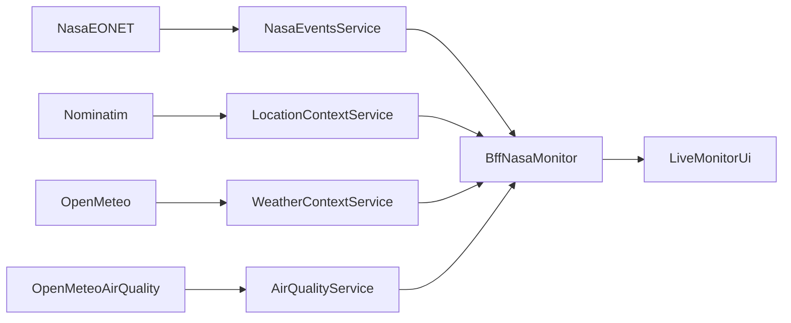

# NASA EONET Live Monitor Plan

Use a NASA-centered application as the workshop target: a live natural-event monitor built around `NASA EONET`, enriched by other free live APIs. The goal is not architectural elegance. The goal is to let five people generate small apps in parallel with OpenSpec and still end up with one coherent demo.

## Selected App

Build a dashboard that shows active natural events from `NASA EONET`, then enriches each selected event with contextual live data.

Recommended split for **five people total**:

- `nasa-events-service`: fetch active events from `NASA EONET`
- `location-context-service`: reverse geocode event coordinates into a readable place using `Nominatim`
- `weather-context-service`: fetch current weather for the event coordinates using `Open-Meteo`
- `air-quality-service`: fetch current air-quality data for the event coordinates using `Open-Meteo Air Quality`
- `bff-nasa-monitor`: aggregate the services and render a simple monitoring page

This keeps every stream independent and uses only free live APIs.



## Why This Is The Right Example

- `NASA EONET` gives you real near-real-time event data
- all enrichments can come from free public APIs
- each service has one very small responsibility
- no hardcoded or mock data is required
- no shared database is required
- the BFF can produce a visually convincing result very quickly

## Minimal Shared Contract

Keep the common rules extremely small:

- every service exposes `GET /health`
- every service exposes one main JSON endpoint
- the `BFF` passes `eventId`, `lat`, and `lon` when needed
- each service returns compact JSON with predictable top-level keys
- failures become simple JSON errors instead of leaking upstream raw errors

Suggested endpoint shape:

- `nasa-events-service`: `GET /api/events`
- `location-context-service`: `GET /api/location?lat=<lat>&lon=<lon>`
- `weather-context-service`: `GET /api/weather?lat=<lat>&lon=<lon>`
- `air-quality-service`: `GET /api/air-quality?lat=<lat>&lon=<lon>`

## OpenSpec Workflow

Use one foundation change plus one change per service:

- `nasa-live-monitor-convention`
- `service-nasa-events`
- `service-location-context`
- `service-weather-context`
- `service-air-quality`
- `bff-nasa-monitor`

For each owner:

1. Use `/opsx:propose` or `/opsx:ff`
2. Generate only one tiny app
3. Keep the app limited to one upstream integration and one main endpoint
4. Stop when the service runs locally and returns live JSON

For the BFF owner:

1. Build a small UI or aggregated endpoint
2. Call the four service APIs
3. Handle missing service responses gracefully
4. Show event cards, coordinates, weather, and air-quality context

## What OpenSpec Should Make Them Surface

The contributors should not need to learn a special prompt-writing method. The point of using OpenSpec is that, as they create and review their change artifacts, they are naturally pushed to clarify the information the rest of the system needs.

What each owner should end up making explicit through OpenSpec:

- what their service is responsible for, and what it is not responsible for
- which upstream API they depend on
- what input their service needs, such as `lat` and `lon`
- what output their service returns to the `BFF`
- what failure cases can happen if the upstream provider is unavailable or invalid
- what endpoint exists and how another service or the `BFF` should call it
- what must be configured, such as env vars or rate-limit assumptions

In practice, OpenSpec should help them discover these questions while filling in:

- `proposal.md`: what the service does and why it exists
- `design.md`: how it calls the upstream API, what input and output shape it exposes, and how it handles errors
- `tasks.md`: the minimum implementation steps needed to make the service runnable

That means the team does not need a rigid shared prompt formula. Instead, OpenSpec becomes the mechanism that reveals missing information and makes the owner write it down in the right place.

## Recommended Repo Layout

- `services/nasa-events/`
- `services/location-context/`
- `services/weather-context/`
- `services/air-quality/`
- `apps/bff/`
- `openspec/changes/`
- `openspec/specs/`

This layout matches the parallel OpenSpec workflow and keeps each generated app isolated.

## Prompt Shape For Service Owners

This is only a helper for facilitation or bootstrapping. It is not a strict format that contributors must memorize or follow exactly.

Use a repeated prompt shape so the five contributors do not need to invent their own structure:

```text
Generate a tiny standalone microservice app.
It should expose:
- GET /health
- one main GET JSON endpoint

Upstream provider: <NASA EONET | Nominatim | Open-Meteo | Open-Meteo Air Quality>
Responsibility: <events | location context | weather context | air-quality context>
Input: <none | lat/lon>
Goal: fetch real live data and return valid JSON quickly.
Do not add a database, auth, mocks, or unnecessary complexity.
```

Use this prompt shape for the BFF:

```text
Generate a tiny BFF app with a simple monitoring interface.
It should call the available service APIs and display the combined results.
Show active NASA natural events and enrich a selected event with location, weather, and air-quality context.
Handle unavailable services gracefully.
Do not add complex state management or auth.
```

## Practical Recommendation

For this workshop, the best default is:

- use `NASA EONET` as the core live data source
- keep the four services thin and read-only
- let the `BFF` own the composition and presentation
- accept low inter-service coherence beyond the minimal contract

That gives the team a concrete, free, real-data application that five people can build in parallel very quickly.